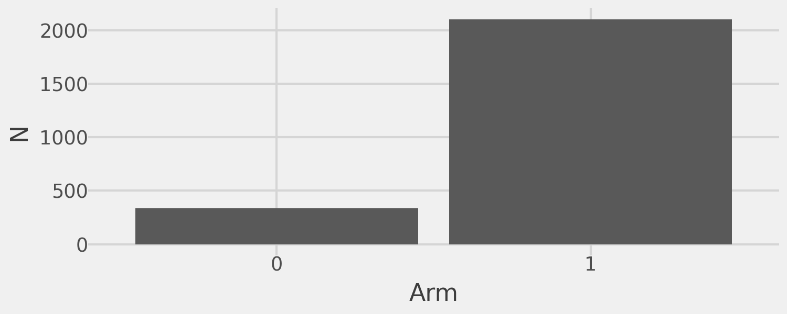
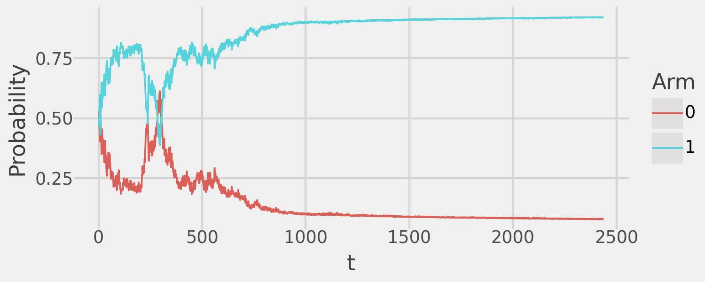

# Robust Adaptive Experiments


The goal of these simulations is to demonstrate how we can design
adaptive experiments that are well-powered and allow anytime-valid
causal inference. Within this framework we can design experiments that
achieve the following goals:

- Any-time valid inference on the ATE; this allows us to stop the
  experiment when statistically significant ATEs are detected.
- Dynamic sample allocation that ensures sufficient sample size to be
  well-powered in all treatment arms.
- Incorporates efficiency gains via the bandit design (e.g. welfare
  boost or reward maximization).

## MAD

The MAD design mixes some Bernoulli randomization with arbitrary MAB
algorithms allowing unbiased ATE estimation with anytime-valid
Confidence Sequences (CS).

The following simple example demonstrates the usefulness of the MAD
design. We will simulate a experiment with a control arm and a treatment
arm. The outcomes from the control arm are sampled ~Bernoulli($\theta$ =
0.5) and the treatment arm are sampled ~Bernoulli($\theta$ = 0.6) for an
ATE = 0.1. The bandit algorithm used here is Thompson Sampling (TS) and
the experiment will stop as soon as a statistically significant ATE has
been detected.

``` python
generator = np.random.default_rng(seed=123)

def reward_fn(arm: int) -> float:
    values = {
        0: generator.binomial(1, 0.5),
        1: generator.binomial(1, 0.6)  # ATE = 0.1
    }
    return values[arm]

exp_simple = MAD(
    bandit=TSBernoulli(k=2, control=0, reward=reward_fn),
    alpha=0.05,
    delta=lambda x: 1./(x**0.24),
    t_star=int(30e3)
)
exp_simple.fit(cs_precision=0, verbose=False)
```

We can demonstrate that the MAD design gives us an unbiased estimate of
the ATE with valid CSs that converge to the truth and are valid across
time.

``` python
(
    exp_simple.plot()
    + pn.coord_cartesian(ylim=(-.5, 1.5))
    + pn.geom_hline(
        mapping=pn.aes(yintercept="ate", color="factor(arm)"),
        data=pd.DataFrame({"arm": list(range(1, 2)), "ate": [0.1]}),
        linetype="dotted"
    )
    + pn.theme(strip_text=pn.element_blank()) 
)
```


### Improving precision

We can also improve precision by not stopping the experiment
immediately. Instead, continue running the experiment until the width of
the CS has decreased sufficiently. For example we can tweak our simple
experiment from above to first improve the width of our CS by 25% and
then stop the experiment.

``` python
exp_simple = MAD(
    bandit=TSBernoulli(k=2, control=0, reward=reward_fn),
    alpha=0.05,
    delta=lambda x: 1./(x**0.24),
    t_star=int(30e3)
)
exp_simple.fit(cs_precision=0.25, verbose=False)

(
    exp_simple.plot()
    + pn.coord_cartesian(ylim=(-.5, 1.5))
    + pn.geom_hline(
        mapping=pn.aes(yintercept="ate", color="factor(arm)"),
        data=pd.DataFrame({"arm": list(range(1, 2)), "ate": [0.1]}),
        linetype="dotted"
    )
    + pn.theme(strip_text=pn.element_blank()) 
)
```


This demonstrates that, due to the anytime-valid CSs of the MAD design,
the user can easily determine the tradeoff between sample size
efficiency and the precision of the ATE estimate(s).

### Bandit benefits

We also are getting the benefits of the underlying bandit algorithm! For
example, we can plot the sample assignment of the algorithm:

``` python
exp_simple.plot_sample()
```


We see that the underlying TS algorithm assigns the majority of the
sample to the optimal arm (Arm 1 is the treatment). This demonstrates
how we can both get valid inference on the ATE and the reward
maximization of the bandit algorithm.

### Limitations

Suppose that we are running an adaptive experiment with multiple
treatment arms. A common problem researchers may face is that they are
**under-powered** to detect non-zero ATEs in the sub-optimal arms. This
results from the bandit algorithm focusing all/most of the sample
assignment to the optimal arm(s) and mostly ignoring the others. We will
demonstrate this with a slightly more complex example. We will simulate
a experiment with a control arm and four treatment arms. The ATEs of the
four arms will be 0.1, 0.12, 0.3, and 0.32 respectively. We will run
this experiment for a fixed sample of 20,000. We should expect that the
bandit algorithm will focus the bulk of the sample on treatment arms 3
and 4 and we may be under-powered in arms 1 and 2.

``` python
def reward_fn(arm: int) -> float:
    values = {
        0: generator.binomial(1, 0.5),  # Control arm
        1: generator.binomial(1, 0.6),  # ATE = 0.1
        2: generator.binomial(1, 0.62), # ATE = 0.12
        3: generator.binomial(1, 0.8),  # ATE = 0.3
        4: generator.binomial(1, 0.82)  # ATE = 0.32
    }
    return values[arm]

exp_simple = MAD(
    bandit=TSBernoulli(k=5, control=0, reward=reward_fn),
    alpha=0.05,
    delta=lambda x: 1./(x**0.24),
    t_star=int(20e3)
)
exp_simple.fit(early_stopping=False, verbose=False)

(
    exp_simple.plot()
    + pn.coord_cartesian(ylim=(-.5, 1.0))
    + pn.geom_hline(
        mapping=pn.aes(yintercept="ate", color="factor(arm)"),
        data=pd.DataFrame({
            "arm": list(range(1, 5)), "ate": [0.1, 0.12, 0.3, 0.32]
        }),
        linetype="dotted"
    )
    + pn.theme(strip_text=pn.element_blank()) 
)
```



As expected, we see that we are well-powered and fairly precise in our
ATE estimates for arms 3 and 4 but are under-powered for both arms 1 and
2 ( CSs include 0). We can confirm that indeed TS focuses the vast
majority of the sampleon arms 3 and 4.

``` python
sample_sizes = pd.DataFrame({
    "arm": list(range(5)),
    "n": [last(n) for n in exp_simple._n]
})

(
    pn.ggplot(sample_sizes, pn.aes(x="factor(arm)", y="n"))
    + pn.geom_bar(
        stat="identity",
        position=pn.position_dodge(width=0.75),
        width=0.7
    )
    + pn.theme_538()
    + pn.labs(x="Arm", y="N")
)
```



## MAD modified

I propose a simple extension of the MAD algorithm to address the
challenge of inadequate power in sub-optimal arms. For each treatment
arm $k \in K$ and time period $t$, I introduce importance weights
$w_{tk} \in [0, 1]$. Once the estimated ATE for arm $k$ becomes
statistically significant, $w_{tk}$ begins to shrink toward zero
according to a user-defined function of $t$.

In the notation of Liang and Bojinov, let $A$ represent an arbitrary
adaptive algorithm. They define $p_t^A(k)$ as the assignment probability
for arm $k$ at time $t$ under $A$. By construction, the set
$\{p_t^A(k)\}_{k \in K}$ of adaptive assignment probabilities for all
$k \in K$ forms a valid probability distribution over $K$, meaning
$\sum_{k \in K}{p_t^A(k)}=1$. I modify these probabilities to
$g(p_t^A(k))$ where $g$ is a function that re-weights $p_t^A(k)$ based
on its corresponding importance weight $w_{tk}$.

For each treatment arm $k \in K$ at time $t$, the re-weighted
probability $g(p_t^A(k))$ is defined as follows:

1.) **Apply Importance Weights**: Each probability is first scaled by
its importance weight: $p_t^*(k)=w_{tk}*p_t^A(k)$.

2.) **Compute Lost Probability Mass**: The probability mass lost due to
down-weighting is: $L_t = \sum_{k \in K}{p_t^A(k)*(1 - w_{tk})}$.

3.) **Compute Relative Redistribution Weights**: The total weight sum
is: $W_t = \sum_{k \in K}{w_{tk}}$. Each arm’s share of the remaining
mass is given by: $r_{tk} = \frac{w_{tk}}{W_t}$.

4.) **Redistribute Lost Mass**: The lost probability mass is
redistributed proportionally to the relative weights:
$p_t^g(k) = p_t^*(k) + (r_{tk} * L_t)$
ptg(k)=pt∗(k)+rtk⋅Ltptg​(k)=pt∗​(k)+rtk​⋅Lt​

5.) **Normalization Check**: Since $\{\p_t^g(k)}_{k \in K}$ is a valid
probability distribution over $K$, it satisfies:
$sum_{k \in K}p_t^g(k)=1$.

Thus, the function $g$ modifies the original assignment probabilities by
scaling each by its importance weight and redistributing the lost
probability mass in a manner that preserves the total probability sum.

### User-Specified Decay of Importance Weights

The importance weight function $w_{tk}$​ determines how quickly the
assignment probability for arm $k$ shrinks once its estimated ATE
becomes statistically significant. This function is user-defined and
controls the balance between two extremes:

- $w_{tk}=1$ for all $t$, which makes $g(p_t^A(k))=p_t^A(k)$, leaving
  the algorithm identical to the original MAD design.
- $w_{tk}=1$ immediately after arm $k$ reaches statistical significance,
  which redirects all future probability mass away from $k$, ensuring
  rapid sample accumulation in underpowered arms.
- More generally, the user defines $w_{tk}$ somewhere in between, where:
  - A slower decay of $w_{tk}$ (closer to 1) retains more influence from
    the adaptive algorithm’s assignment probabilities.
  - A faster decay (closer to 0) shifts the algorithm toward
    prioritizing underpowered arms at the expense of reward
    maximization.

Reasonable choices for $w_{tk}$ include polynomial decay, exponential
decay, etc. allowing flexibility in tuning the extent of sample
reallocation.

## Algorithm comparison

Now, let’s compare the relative benefits of the two algorithms. We will
see that the modified algorithm allows us to be well-powered in all
treatment arms and gives us significantly more precision than the MAD
algorithm with equal sample size. However, this comes with the tradeoff
of increased sample being assigned to sub-optimal treatment arms.

``` python
# Run the modified algorithm
mad_modified = MADModified(
    bandit=TSBernoulli(k=5, control=0, reward=reward_fn),
    alpha=0.05,
    delta=lambda x: 1./(x**0.24),
    t_star=int(20e3)
)
mad_modified.fit(cs_precision=0.1, verbose=False, early_stopping=True)

# Run the vanilla algorithm
mad_vanilla = MAD(
    bandit=TSBernoulli(k=5, control=0, reward=reward_fn),
    alpha=0.05,
    delta=lambda x: 1./(x**0.24),
    t_star=mad_modified._bandit._t
)
mad_vanilla.fit(verbose=False, early_stopping=False)

# Compare the ATEs and CSs
ates = pd.concat(
    [
        mad_modified.estimates().assign(which="modified"),
        mad_vanilla.estimates().assign(which="mad"),
        pd.DataFrame({
            "arm": list(range(1, 5)),
            "ate": [0.1, 0.12, 0.3, 0.32],
            "which": ["truth"]*(4)
        })
    ],
    axis=0
)
(
    pn.ggplot(
        ates,
        mapping=pn.aes(
            x="factor(arm)",
            y="ate",
            ymin="lb",
            ymax="ub",
            color="which"
        )
    )
    + pn.geom_point(position=pn.position_dodge(width=0.3))
    + pn.geom_errorbar(position=pn.position_dodge(width=0.3), width=0.2)
    + pn.theme_538()
    + pn.labs(x="Arm", y="ATE", color="Method")
)
```

    /Users/dmolitor/Documents/code/robust-adaptive-experiments/.venv/lib/python3.11/site-packages/plotnine/layer.py:364: PlotnineWarning: geom_errorbar : Removed 4 rows containing missing values.


