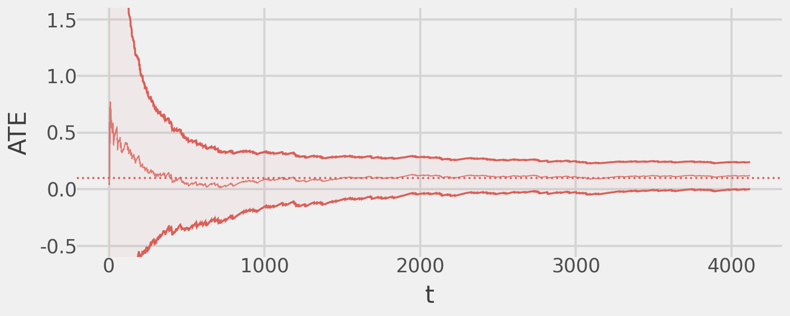

# Robust Adaptive Experiments


The goal of these simulations is to demonstrate how we can design
adaptive experiments that are well-powered and allow anytime-valid
causal inference. Within this framework we can design experiments that
achieve the following goals:

- Any-time valid inference on the ATE; this allows us to stop the
  experiment when statistically significant ATEs are detected.
- Dynamic sample allocation that ensures sufficient sample size to be
  well-powered in all treatment arms.
- Incorporates efficiency gains via the bandit design (e.g. welfare
  boost or reward maximization).

## MAD

The MAD design mixes some Bernoulli randomization with arbitrary MAB
algorithms allowing unbiased ATE estimation with anytime-valid
Confidence Sequences (CS).

The following simple example demonstrates the usefulness of the MAD
design. We will simulate a experiment with a control arm and a treatment
arm. The outcomes from the control arm are sampled
~Bernoulli($\theta=0.5$) and the treatment arm are sampled
~Bernoulli($\theta=0.6$) for an ATE = $0.1$. The bandit algorithm used
here is Thompson Sampling and the experiment will stop as soon as a
statistically significant ATE has been detected.

``` python
generator = np.random.default_rng(seed=123)

def reward_fn(arm: int) -> float:
    values = {
        0: generator.binomial(1, 0.5),
        1: generator.binomial(1, 0.6)
    }
    return values[arm]

exp_simple = MAD(
    bandit=TSBernoulli(k=2, control=0, reward=reward_fn),
    alpha=0.05,
    delta=lambda x: 1./(x**0.24),
    t_star=int(30e3)
)
exp_simple.fit(cs_precision=0, verbose=False)
```

We can demonstrate that the MAD design gives us an unbiased estimate of
the ATE with valid CSs that converge to the truth and are valid across
time.

``` python
(
    exp_simple.plot()
    + pn.coord_cartesian(ylim=(-.5, 1.5))
    + pn.geom_hline(
        mapping=pn.aes(yintercept="ate", color="factor(arm)"),
        data=pd.DataFrame({"arm": list(range(1, 2)), "ate": [0.1]}),
        linetype="dotted"
    )
    + pn.theme(strip_text=pn.element_blank()) 
)
```



### Improving precision

We can also improve precision by not stopping the experiment
immediately. Instead, continue running the experiment until the width of
the CS has decreased sufficiently. For example we can tweak our simple
experiment from above to first improve the width of our CS by 50% and
then stop the experiment.

``` python
exp_simple = MAD(
    bandit=TSBernoulli(k=2, control=0, reward=reward_fn),
    alpha=0.05,
    delta=lambda x: 1./(x**0.24),
    t_star=int(30e3)
)
exp_simple.fit(cs_precision=0.5, verbose=False)

(
    exp_simple.plot()
    + pn.coord_cartesian(ylim=(-.5, 1.5))
    + pn.geom_hline(
        mapping=pn.aes(yintercept="ate", color="factor(arm)"),
        data=pd.DataFrame({"arm": list(range(1, 2)), "ate": [0.1]}),
        linetype="dotted"
    )
    + pn.theme(strip_text=pn.element_blank()) 
)
```


This demonstrates that, due to the anytime-valid CSs of the MAD design,
the user can easily determine the tradeoff between sample size
efficiency and the precision of the ATE estimate(s).
